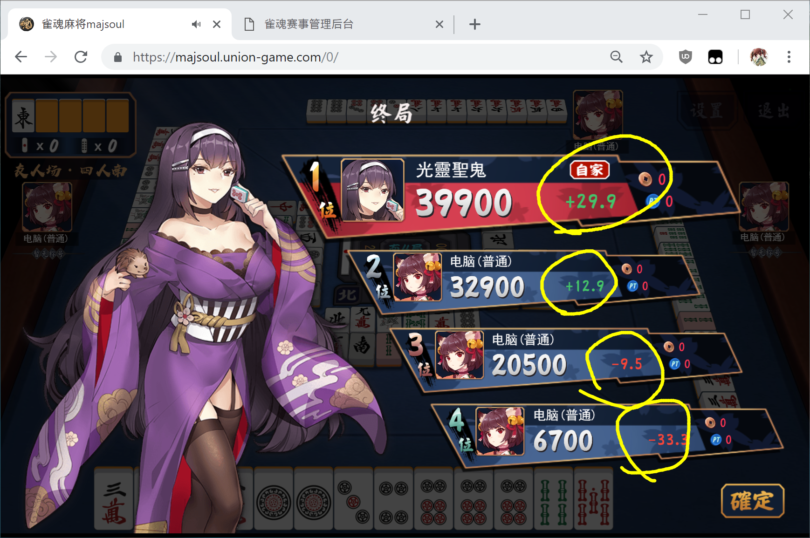

# 第一届摸雀英豪会
今晚 19:00到23:00 萌羽和大V们在@雀魂麻将majsoul 举办第一届摸雀英豪会（赛事ID：305595 ）  
赛事将由B站知名主播 蓝毛 进行直播（今晚 19:00开始，会提前一些开直播）  
直播间地址：https://live.bilibili.com/104  
手机和ipad上B站app在直播搜：104 主播id：佐仓•M•沙耶加  

比赛选手请加雀魂比赛QQ群：261740755（不加群也可以正常参加比赛，注意时间即可）  
比赛相关问题群内管理员会进行解答！

《微博大V陪你过新年，第一届摸雀英豪会（赛事ID：305595，请先关注赛事）》  
由空無月、幽々子、小和和 三位大佬帮忙完成了赛事规则【比赛日程调整为4天】：

## 游戏规则
游戏规则和雀魂段位半庄战完全相同，没有特殊规则

## 计分规则
雀魂段位半庄战完全相同，即：  
成绩=(最终点数-25000)÷1000+顺位赏  
其中：  
* 1位，顺位赏= +15
* 2位，顺位赏= +5
* 3位，顺位赏= -5
* 4位，顺位赏= -15

## 赛程
### 01月30日【混战】
    【混战规则】
    选手在19:00到23:00时，打3战以上
    每个人的成绩=最后3战合计值
    成绩前40晋级下一轮

### 01月31日【混战】
    【混战规则】
    选手在19:00到23:00时，打3战以上
    每个人的成绩=最后3战合计值
    成绩前16晋级下一轮
    如果晋级的大V=1人，非晋级的大V里，积分最高的1人也晋级
    如果晋级的大V=0人，非晋级的大V里，积分最高的2人也晋级
    大V挤掉最后一个晋级名额

### 02月01日【淘汰赛】
    【淘汰赛规则】
    打2次半庄，淘汰一半(16->08)
    打2次半庄，淘汰一半(08->04)

### 02月02日【决赛】
    【淘汰赛规则】
    打3次半庄，看积分和决出名次

## 参赛方法
进入游戏  
→【比赛场】  
→【赛事大厅】  
→右上角【输入赛事ID】  
→输入：305595  
→点击【准备比赛】   
出现【等待开始】即成功（建议点一下右上角的关注）

* 你的排名在游戏里，会实时显示出来，可自行查看（见：上图，右侧中部的【我的排名】）

### 大混战
* 时间段内，满4人约战，就会开局
* 选手不需要一直打，也不需要晚上7点就立刻开始打。最后打满3战以上即可。
* 小于3战是弃权
* 第一轮只有40个晋级名额，大约淘汰一半
* 最好多次确认自己成绩
* 晚上7点到晚上11点一直打的话，大约能打6~7次半庄
* 一次半庄大约40分钟左右

